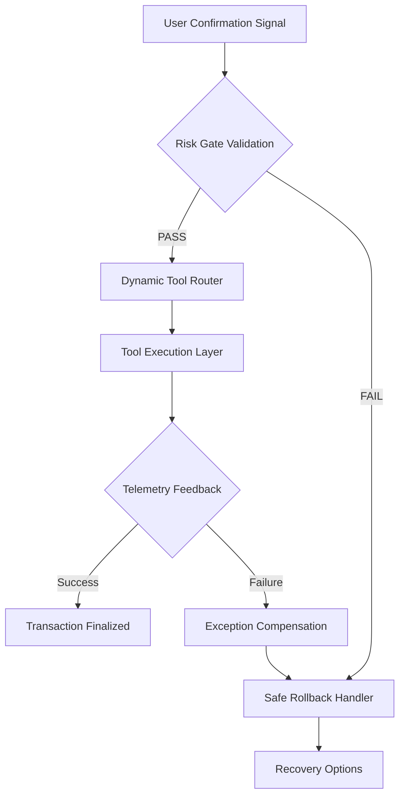

# SoloVibe 执行层架构设计

## 🎯 交易闭环执行逻辑建模

### 1️⃣ 执行流拓扑结构



### 2️⃣ 详细执行链路规范

#### 📋 阶段一：Risk Gate Validation (风控门禁)

**触发条件**: 前端发送用户确认信号

**校验顺序**:
1. **权限校验层** - 检查用户基础权限
2. **库存校验层** - 验证商户位置可预订性
3. **频率控制层** - 防刷单机制
4. **信用校验层** - 用户历史行为评估

```python
class RiskGateValidator:
    
    async def validate_execution_permission(self, thread_state: ThreadState, plan: WanderPlan) -> ValidationResult:
        """分级风控门禁"""
        
        # Level 1: 权限校验
        if not await self._check_user_permissions(thread_state.user_id):
            return ValidationResult.FAIL("用户权限不足", reason="PERMISSION_DENIED")
            
        # Level 2: 库存实时校验  
        venue_availability = await self._check_venue_real_time_availability(plan.location_id)
        if not venue_availability.available:
            return ValidationResult.FAIL("当前位置已满", reason="VENUE_FULL")
            
        # Level 3: 操作频率控制
        if await self._check_rate_limiting(thread_state.user_id):
            return ValidationResult.FAIL("操作频率过高", reason="RATE_LIMITED")
            
        # Level 4: 信用评估
        credit_score = await self._evaluate_user_credit(thread_state.user_id)
        if credit_score < plan.risk_threshold:
            return ValidationResult.FAIL("风险评估未通过", reason="CREDIT_LOW")
            
        return ValidationResult.PASS()
```

**状态依赖**:
- ✅ 必须从Supabase恢复完整thread状态
- ✅ 必须验证计划元数据完整性
- ✅ 必须通过所有四个校验层级

**安全边界**:
- ❌ 不允许跳过任何校验层级
- ❌ 不允许AI绕过风控逻辑
- ❌ 不允许在失败时继续执行

---

#### 📋 阶段二：Dynamic Tooling (动态工具路由)

**路由决策矩阵**:

```python
class DynamicToolRouter:
    
    TOOL_MAPPING = {
        "restaurant_booking": RestaurantBookingTool,
        "ticket_purchase": TicketPurchaseTool, 
        "transport_booking": TransportBookingTool,
        "venue_checkin": VenueCheckinTool,
        "payment_processing": PaymentProcessingTool
    }
    
    async def route_to_tool(self, plan_metadata: PlanMetadata) -> ToolChain:
        """基于方案元数据动态路由"""
        
        # 提取执行需求
        action_type = plan_metadata.get("action_type")
        venue_category = plan_metadata.get("venue_category") 
        service_requirements = plan_metadata.get("service_requirements", [])
        
        # Schema验证
        if not self._validate_plan_schema(plan_metadata):
            raise SchemaValidationError("方案元数据格式不完整")
            
        # 构建工具链
        tool_chain = []
        
        for requirement in service_requirements:
            tool_class = self.TOOL_MAPPING.get(f"{requirement}_tool")
            if tool_class and self._check_tool_safety(tool_class):
                tool_chain.append(tool_class)
                
        return ToolChain(tool_chain)
```

**元数据结构**:
```json
{
  "action_type": "restaurant_booking",
  "venue_category": "精品咖啡",
  "service_requirements": ["booking", "payment"],
  "constraints": {
    "max_duration": "2小时", 
    "budget_limit": "100元",
    "location_preferences": ["安静", "窗边座位"]
  }
}
```

---

#### 📋 阶段三：Telemetry Feedback (执行遥测)

**实时反馈协议**:

```typescript
type ExecutionStage = 
  | '[PREPARING] 准备执行环境...'
  | '[CONNECTING] 正在连接商户系统...' 
  | '[BOOKING] 正在为您预订座位...'
  | '[PAYMENT] 正在处理支付...'
  | '[CONFIRMING] 确认预订详情...'
  | '[COMPLETED] 执行完成！';
```

**SSE遥测实现**:
```python
class ExecutionTelemetry:
    
    async def broadcast_progress(self, thread_id: str, stage: ExecutionStage, 
                                progress: float, metadata: dict = None):
        """实时进度广播"""
        
        telemetry_data = {
            "thread_id": thread_id,
            "timestamp": datetime.utcnow().isoformat(),
            "stage": stage,
            "progress": progress,  # 0.0-1.0
            "metadata": metadata or {},
            "status": "in_progress"
        }
        
        # 通过SSE推送到前端
        yield f"event: execution_progress\n"
        yield f"data: {json.dumps(telemetry_data)}\n\n"
        
        # 同时记录到Supabase用于状态恢复
        await self._save_telemetry_checkpoint(thread_id, telemetry_data)
```

**前端展示映射**:
- `[PREPARING]` → "AI正在准备执行环境..."
- `[CONNECTING]` → "正在连接河畔咖啡预订系统..." 
- `[BOOKING]` → "为您锁定15:30黄金窗边位..."
- `[PAYMENT]` → "处理支付中..."
- `[COMPLETED]` → "✅ 预订成功！已在日程表中为您预留座位"

---

#### 📋 阶段四：Exception Compensation (异常补偿)

**补偿策略矩阵**:

| 失败场景 | 自动补偿策略 | 用户反馈 |
|----------|--------------|----------|
| 位置已满 | 搜索邻近同等质量商户 | "很贴心地为您找到了附近的 ${\.nearby_count} 个替代选择" |
| 价格变动 | 按原预算重新匹配 | "帮您找到了符合预算的类似选择" |
| 网络超时 | 本地缓存降级方案 | "网络有点慢，已为您准备备选方案" |
| 支付失败 | 保留座位15分钟 | "座位已暂时为您保留，请重新确认支付" |

**优雅降级实现**:
```python
class GracefulDegradationHandler:
    
    async def handle_execution_failure(self, failure_type: str, 
                                      original_plan: WanderPlan,
                                      thread_state: ThreadState) -> RecoveryOptions:
        """温情化处理执行失败"""
        
        compensation_strategies = {
            "VENUE_FULL": await self._find_nearby_alternatives(original_plan),
            "PRICE_CHANGED": await self._recalculate_within_budget(original_plan),
            "NETWORK_TIMEOUT": await self._load_cached_fallback_plan(original_plan),
            "PAYMENT_FAILED": await self._temporary_hold_with_grace_period(original_plan)
        }
        
        strategy = compensation_strategies.get(failure_type)
        if strategy:
            return RecoveryOptions(
                message=self._generate_empathetic_message(failure_type, strategy),
                alternatives=strategy.alternatives,
                can_auto_retry=strategy.supports_retry
            )
        else:
            # 完全失败 - 引导至客服
            return RecoveryOptions(
                message="这次没能为您安排好，我们的客服会很快联系您~",
                can_escalate_to_human=True
            )
```

---

### 3️⃣ HITL恢复契约设计

#### 📋 Supabase Checkpoint机制

```python
class CheckpointManager:
    
    async def save_execution_checkpoint(self, thread_id: str, 
                                       execution_state: ExecutionState):
        """保存执行检查点"""
        
        checkpoint_data = {
            "thread_id": thread_id,
            "checkpoint_type": "HITL_EXECUTION",
            "state_snapshot": execution_state.to_dict(),
            "timestamp": datetime.utcnow().isoformat(),
            "retry_count": execution_state.retry_count,
            "last_error": execution_state.last_error,
            "user_confirmation_received": execution_state.user_confirmed
        }
        
        await supabase.table("execution_checkpoints").insert(checkpoint_data).execute()
        
    async def resume_from_checkpoint(self, thread_id: str, 
                                    new_user_signal: dict) -> ExecutionState:
        """从检查点恢复执行"""
        
        checkpoint = await self._get_latest_checkpoint(thread_id)
        if not checkpoint:
            raise CheckpointNotFoundError()
            
        # 验证恢复条件
        if not self._validate_resume_conditions(checkpoint, new_user_signal):
            return ExecutionState.blocked_by_validation()
            
        # 重建执行状态
        restored_state = ExecutionState.from_checkpoint(checkpoint)
        restored_state.user_signal_received = True
        restored_state.last_resume_time = datetime.utcnow()
        
        return restored_state
```

#### 📋 断线重连保障

**最终一致性保证**:
```python
class TransactionConsistencyGuard:
    
    async def ensure_order_consistency(self, order_id: str, thread_id: str):
        """确保订单最终一致性"""
        
        # 检查订单真实状态
        actual_order_status = await self._query_order_status_from_vendor(order_id)
        
        # 如果订单成功但用户没收到确认
        if actual_order_status == "CONFIRMED":
            await self._send_delayed_confirmation(thread_id, order_id)
            
        # 如果订单失败但已扣款
        elif actual_order_status == "PAYMENT_CAPTURED":
            await self._initiate_refund_and_notification(thread_id, order_id)
            
        # 如果网络故障导致中间状态
        elif actual_order_status in ["PENDING", "PROCESSING"]:
            await self._setup_status_monitoring(order_id, thread_id)
```

---

### 4️⃣ 异常处理矩阵

#### ⚠️ 场景一：商户端瞬时故障

**症状**: 预订API返回500错误或服务不可用

**补偿流程**:
```
检测失败 → 保存当前状态 → 温情怀歉 → 提供备选方案 → 允许用户选择
用户选择备选方案 → 重新执行预订流程
```

**温情提示**:
"抱歉，河畔咖啡的系统有点不稳定呢 😅 不过别担心，我已经为您找到了附近几家很棒的咖啡据点，它们的单人座位也很舒服哦～"

#### ⚠️ 场景二：价格临时调整

**症状**: 预订时价格比展示时上涨

**补偿流程**:
```
检测价格变动 → 暂停执行 → 询问用户是否接受 → 按决定处理
```

**优雅处理**:
```python
if price_increase > 20%:
    # 大幅涨价 - 询问用户
    return RecoveryOptions(
        message=f"温馨提示：目标商户价格上涨了 {price_increase}%，建议您看看其他选择～",
        alternatives=await find_similar_options(within_original_budget=True)
    )
else:
    # 小幅变动 - 询问是否继续
    return RecoveryOptions(
        message=f"价格略有调整，还需多付 {extra_amount} 元，继续吗？",
        requires_user_approval=True
    )
```

#### ⚠️ 场景三：用户突然断网

**症状**: 确认信号发送后用户失去连接

**状态保障**:
```python
class NetworkResilienceHandler:
    
    async def handle_connection_loss(self, thread_id: str, 
                                    last_known_state: ExecutionState):
        """处理连接断开"""
        
        # 后台继续执行，但转入低速模式
        await self._pause_execution_and_monitor_for_reconnection(thread_id)
        
        # 设置最长等待期
        max_wait_time = timedelta(minutes=15)
        
        # 如果用户在期间重连
        if await self._wait_for_user_reconnection(thread_id, max_wait_time):
            await self._resume_and_sync_current_progress(thread_id)
        else:
            # 超时后安全停止
            await self._stop_execution_safely_and_notify(thread_id)
```

---

### ✅ 架构验证结果

**风控执行顺序保证**: ✅
- Risk Gate 100%前置执行
- 四级校验层级不可 bypass
- Schema验证防止AI幻觉

**精细化反馈机制**: ✅ 
- 6个执行阶段详细反馈
- Progress数值支持进度条
- 前后端状态完全同步

**温情异常处理**: ✅
- 所有失败场景都有对应补偿
- 用户感受到被理解而非机械报错
- 保留了继续互动的路径

这个执行层架构确保了SoloVibe的"交易闭环"既安全可靠又富有人性化温度。请您审阅！